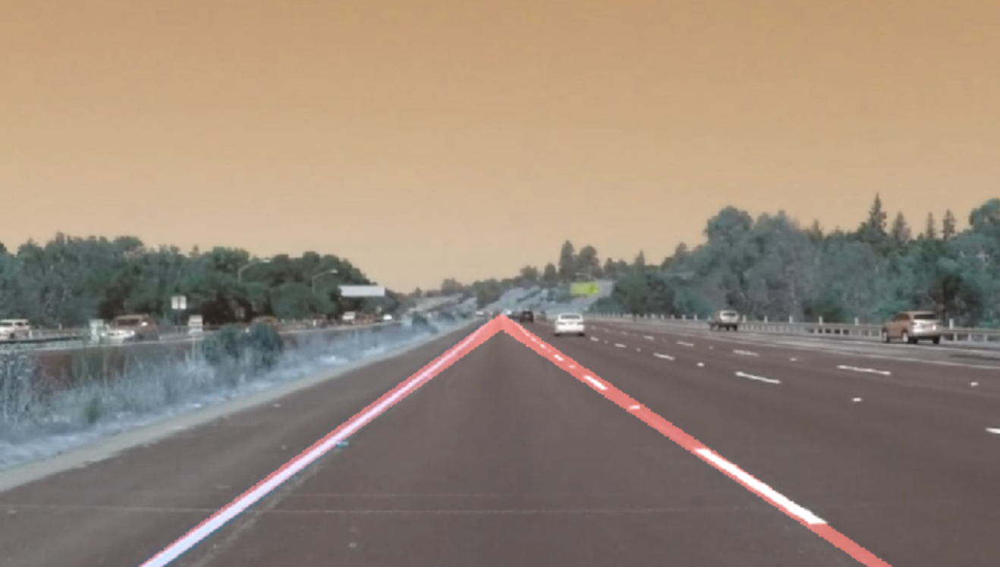
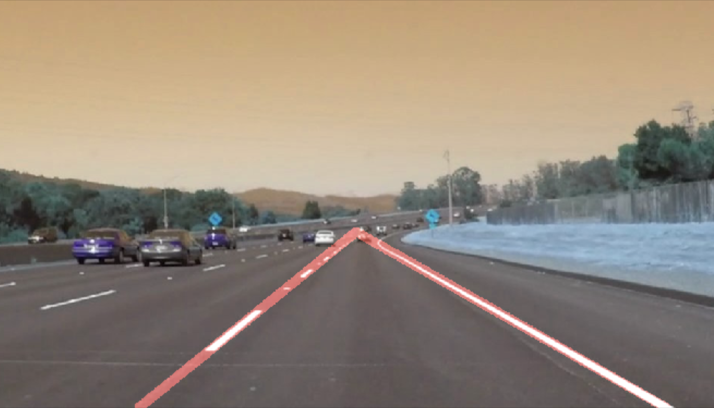

# Finding Lane Lines Project

---

## Goals

Identify and highlight lane lines in images and short video.

## Implementation Overview

Usage of Opencv's Canny edge detection and Hough line transform functiontionality to detect and highlight lane lines. 

## Reference Screenshots

---

## Pipeline Overview

1. load an image (or video frame)
2. convert to grayscale (to avoid pitfall of non-white color lane-lines)
3. perform canny edge detection
4. remove everything outside region of interest
5. perform the Hough transform to detect lines 
6. average out and extrapolate the lines (lane lines are detected as double, parallel, segments (edges) - combine them into single lines, stretch to the horizon the image)
7. overlay the average lines image untop the original image/frame

__NOTE:__ see jupyter notebook for in-depth process walkthrough.

## Shortcomings

Where to begin? the implementation is naive. 

#### Intensity Shortcomings

converting to grayscale makes the model likely to fail when intensity is changed:

1.  lightening and reflections - sunlight or even nightlamps reflecting off of the asphalt 
2.  car headlights - may make the lane lines not be detected as lines. 
3. material variations - e.g some roads are concrete, which is light gray.
4. Etc

#### Chroma Shortcomings

1. the model is effectively color blind, meaning artifacts which are easily discrenible via chroma but having a similar intensity may cause the model to fail. 

#### Geometrical Shortcomings

1. camera orientation - even small differences in position may render the model useless.
2. camera type
3. vehicle size - e.g a truck will position the camera higher
4. curving roads - the model may fail due to there not being any straight lines
5. etc

#### Obstructions

various objects partially or wholly obstructing lane lines

1. acute - e.g a dog runnig across the road

2. chronic - e.g mud on the windshield 

3. etc 

	​

## Possible Improvements

### Handling Curves

Trying to match curving lines instead of just straight lines.

### Chroma Utilization

Lane line indetification via chroma variation instead of just intensity.

### Acute Obstruction Avoidance

Using previously calculated values to avoid momentary failures due to various objects. 